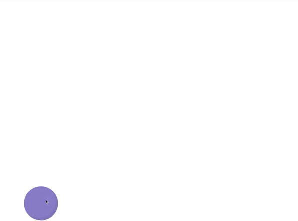

L’exercice consiste à la création d’une page Web responsive (minimum de 320x480pixels) en HTML, Typescript, et SASS (ou Compass) permettant à l’utilisateur de déplacer un ballon (le plus réaliste possible visuellement). Et quand l’utilisateur le lâchera, il doit rebondir sur le bas de l’écran, et perdre de sa vélocité au fur et à mesure des rebonds.

The exercise consists of creating a responsive web page (minimum 320x480pixels), with an HTML, Typescript, and SASS (or Compass) environment, and allowing the user to move a ball (as visually realistic as possible). And when the user drops it, it should bounce off the bottom of the screen, and lose velocity as it bounces.

